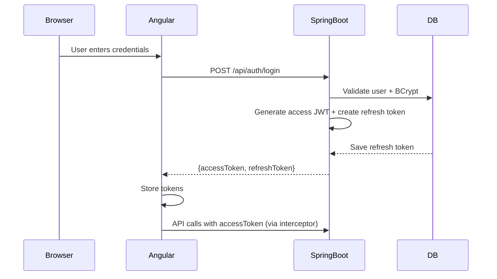

# Architecture Overview

## High-Level Design

**Grok Dev** is a modern full-stack application following clean architecture principles.

### Layers

**Backend (Spring Boot)**
- **Presentation Layer**: REST Controllers (`AuthController`, `WelcomeController`, `ProjectController`)
- **Application Layer**: Services (`UserService`) — business logic
- **Domain Layer**: Entities (`User`, `Project`, `Role`)
- **Infrastructure Layer**: Repositories, Security (`JwtUtil`, `JwtAuthenticationFilter`)

**Frontend (Angular)**
- **Presentation**: Standalone Components (`LoginComponent`, `WelcomeComponent`)
- **Services**: `AuthService` (handles token storage and login)
- **Infrastructure**: HTTP Interceptor for JWT

### Authentication Flow (JWT + Refresh Tokens)

**Proactive Refresh Logic**:
- Before requests: If access token expires in <5 min → refresh first
- On 401: Interceptor triggers refresh automatically
- On app load: `ensureValidSession()` is called by AuthGuard

1. Client sends POST `/api/auth/login` with credentials
2. Backend authenticates using `UserService` + BCrypt
3. `JwtUtil` generates short-lived access JWT + `RefreshTokenService` creates long-lived refresh token (stored in DB)
4. Client stores both tokens
5. Requests include `Authorization: Bearer <accessToken>`
6. `JwtAuthenticationFilter` validates access token
7. On 401: Angular interceptor calls `/refresh` with refresh token to get new access token
8. Logout revokes refresh token server-side
9. `SecurityConfig` is stateless
10. On app startup / protected route access → `ensureValidSession()` checks token expiry and refreshes proactively if needed.
11. `AuthInterceptor` proactively refreshes tokens if they are expiring soon (< 5 min) **before** sending requests.
12. Welcome screen shows a **live countdown timer** and conditionally renders role-based components (Admin features only for ROLE_ADMIN).

### SOLID Principles Applied

- **S**ingle Responsibility: Each class has one job (e.g. `JwtUtil` only handles tokens, `PasswordEncoderConfig` only provides the encoder)
- **O**pen/Closed: `UserDetailsService` can be swapped
- **L**iskov Substitution: Repositories extend JpaRepository
- **I**nterface Segregation: Separate interfaces for auth concerns
- **D**ependency Inversion: High-level code depends on abstractions (interfaces for services and repositories)

**Circular Dependency Handling**:
We extracted `PasswordEncoder` into a dedicated `PasswordEncoderConfig` class to break the cycle:
`SecurityConfig → UserService → PasswordEncoder (was inside SecurityConfig)`

`@Lazy` is used on `UserService` and `UserDetailsService` as a defensive measure.

### Design Patterns Used

- **Repository Pattern**: `UserRepository`, `ProjectRepository`
- **Strategy Pattern**: Authentication handled via `AuthenticationManager`
- **Factory (implicit)**: Spring `@Bean` creation
- **Interceptor / Filter Pattern**: `JwtAuthenticationFilter` and Angular `AuthInterceptor`
- **DTO Pattern**: `LoginRequest`, `RefreshTokenRequest`

### Data Flow

Login → JWT generation (access + refresh) → Token stored → Interceptor adds header → Backend filter validates → Protected resources accessible

Proactive refresh and role-based features are also supported.

## Deployment Notes

- Backend on 8080, frontend on 4200 (CORS configured)
- Postgres required with schema `grok_dev`
- JWT secret should be moved to environment variables in production

This design ensures maintainability, testability, and separation of concerns.

## MT5 Data Ingestion Layer (Python)

A separate Python component (`python/mt5_xauusd/`) acts as the data pipeline:

- Connects to MetaTrader 5 terminal (`terminal64.exe`)
- Downloads full + incremental OHLC data for XAUUSD
- Writes to Postgres tables in `grok_dev` schema:
  - `XAUUSD_D1`, `XAUUSD_H4`, `XAUUSD_H1`, `XAUUSD_M15`, `XAUUSD_M5`, `XAUUSD_M1`

**Why separate?**
- MT5 Python API (`MetaTrader5`) is Python-only
- Allows independent scheduling (Task Scheduler / cron)
- Keeps Java/Spring focused on API + business logic

**Data Flow:**
MT5 Terminal → Python Downloader (batched + incremental) → Postgres (grok_dev schema) → Spring Boot MarketDataService (JdbcTemplate) → REST API → Angular

Spring Boot uses `JdbcTemplate` for flexible queries against the dynamic timeframe tables.

### Frontend UI/UX Principles (Mobile & Tablet First)
- Designed for **Realme P2 Pro** (phone) and **Realme Pad 2** (tablet).
- User perspective first: Traders need fast access to latest price, direction, and recent candles.
- Enriched experience: Big hero price card, % change, interactive Chart.js line chart, color-coded rows.
- Ease of access: Scrollable timeframe pills, preset buttons, one-tap refresh.
- Responsiveness: Stacked cards on mobile, full table on tablet/desktop. Large tap targets, minimal scrolling.
- All changes consider touch, readability, and information hierarchy on small screens.

See `python/mt5_xauusd/INTEGRATION.md` for entity examples.

See root [CHANGELOG.md](../CHANGELOG.md) for complete history of changes across the application.